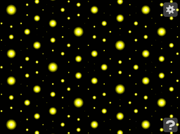

# Quasicrystals

## Hey, watch this!

* [Live demo](http://pteromys.melonisland.net/quasi/)
* [Pizza Seminar notes](http://pteromys.melonisland.net/w/2015/quasi/)

https://github.com/pteromys/quasi/assets/380280/bfff0cfa-c767-4f40-b764-3d2bc16b3188

## Prior Art

* K. Niizeki, [Self-similarity of quasilattices in two dimensions. I. The n-gonal quasilattice][Niizeki],
  Journal of Physics A: Mathematical and General, Vol. 22, No. 2
* Jason Davies, [Animated Quasicrystals][Davies]
* keegan, [Quasicrystals as sums of waves in the plane][keegan]
* Michael Rule, [various posts tagged "quasicrystal"][MichaelRule]

[Niizeki]: http://iopscience.iop.org/0305-4470/22/2/009
[Davies]: https://www.jasondavies.com/animated-quasicrystals/
[keegan]: http://mainisusuallyafunction.blogspot.com/2011/10/quasicrystals-as-sums-of-waves-in-plane.html
[MichaelRule]: http://wealoneonearth.blogspot.com/search/label/quasicrystal

## Licenses

* This project itself is released under the [Unlicense](http://unlicense.org/).
* [jQuery](https://jquery.org/license/) and
  [HammerJS](https://github.com/hammerjs/hammer.js/blob/master/LICENSE.md)
  are used under the
  [MIT License](https://opensource.org/licenses/MIT).
* [MathJax](https://docs.mathjax.org/en/v2.5-latest/misc/faq.html),
  [nutkit-umbra](https://github.com/pteromys/nutkit-umbra), and
  [nutkit-anima](https://github.com/pteromys/nutkit-anima)
  are used under the
  [Apache License, Version 2.0](http://opensource.org/licenses/Apache-2.0).
